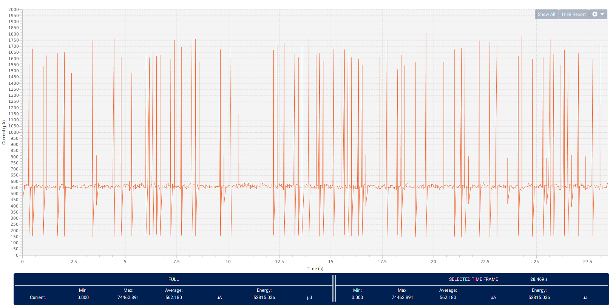
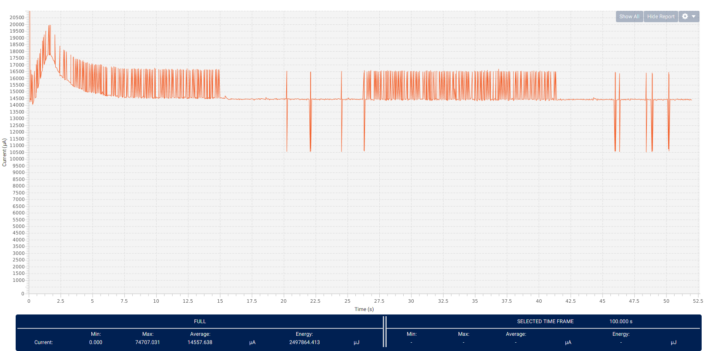
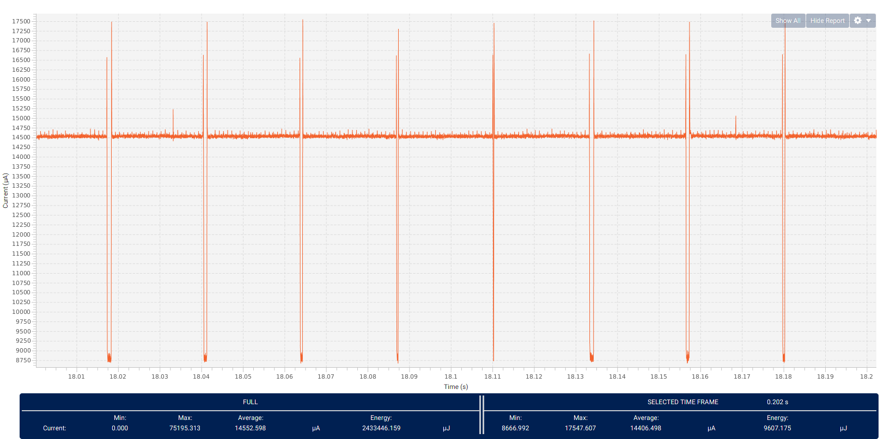
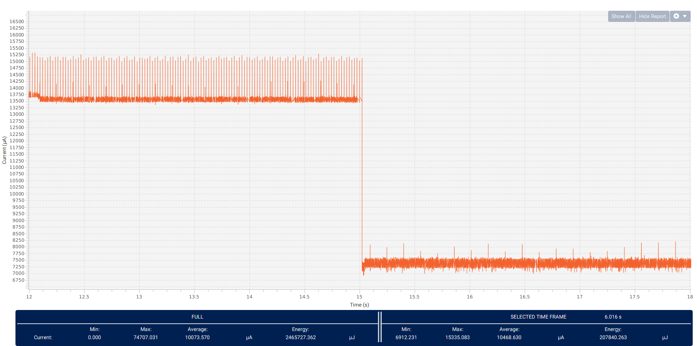

# Power consumption

- [Power consumption](#power-consumption)
  - [Base consumption](#base-consumption)
  - [Consumption with code at commit fc5c498e](#consumption-with-code-at-commit-fc5c498e)
  - [Consumption with code at commit 4c3d4209](#consumption-with-code-at-commit-4c3d4209)
  - [Consumption with code at commit 39529eb9](#consumption-with-code-at-commit-39529eb9)
  - [Consumption with code at commit 8b27f1d1](#consumption-with-code-at-commit-8b27f1d1)

## Base consumption

In that case, the main function is limited to the following code :

```cpp
int main(void) {
  /* USER CODE BEGIN 1 */
  LCD_DeInit();
  while (1) {
    HAL_PWR_EnterSLEEPMode(PWR_MAINREGULATOR_ON, PWR_SLEEPENTRY_WFI);
  }
}
```

In that configuration, the power consumption measured with STM32CubeMonitor-Power is the following


The average consumption reported is around 560µA. In this configuration, the board is in its reset state since almost nothing has been initialized. It's a good basis for comparison for power consumption measured with the final hardware

## Consumption with code at commit fc5c498e

The power consumption optimization features implemented so far are :

- Enter Sleep mode when there's only the analog watchdog for the microphone running
- Deactivate the LCD module (backlight and LCD driver)
- Turn off all onboard LEDs when going into sleep mode
- Remove all timers since at this point none is used by the firmware
- Disable DMA interrupts for the DFSDM when going into sleep mode

In that configuration, the power consumption measured with STM32CubeMonitor-Power is the following


- The average consumption reported is around 14.5mA
- The active phase (board awake and "saving" samples) oscillates between 14.5mA and 16.5mA
- The asleep phase oscillates betwwen 10.5mA and 16.5mA

The optimization efforts will focus on the asleep phase since the system will spend most of its time in this mode (100 noisy events of 15s per day : 1500s active out of 86400s in a day so a very conservative estimate is at least 95% of the time spent in this mode).

The code was compiled with the following flags

```
DEBUG = 1
OPT = -O0
```

## Consumption with code at commit 4c3d4209

The power consumption optimization features added are :

- Deactivate the FMC when going into sleep mode

As mentionned before, we will focus in a first time on the consumption during the asleep mode. In that configuration, the power consumption measured with STM32CubeMonitor-Power is the following for this phase


- The average value is around 14.5mA
- During a short period of time (approx 700µs), the consumption goes down to 8.75mA
- During an even shorter period of time, the consumption reaches 17.5mA

The code was compiled with the following flags

```
DEBUG = 1
OPT = -O0
```

## Consumption with code at commit 39529eb9

The power consumption optimization features added are :

- Deactivate the CRC and OctoSPI when going into sleep mode
- Remove all unused pins initialization
- Disable the system ticks when going into sleep to avoid periodic wakeups

In that configuration, the power consumption measured with STM32CubeMonitor-Power is the following


- The consumption during the sleep phase is now approximately constant (removal of period wake ups)
- The consumption during the sleep phase has decreased from 8.75mA to 7.35mA (deactivation of peripherals)

A coarse estimation of the battery life with a battery of 3000mAh gives 2 weeks, which is a good first milestone.

The code was compiled with the following flags

```
DEBUG = 1
OPT = -O0
```

## Consumption with code at commit 8b27f1d1

The power consumption optimization features added are :

- Deactivation of the DMA for the DFSDM when entering sleep phase

In that configuration, the power consumption measured with STM32CubeMonitor-Power is the following


- The consumption during the sleep phase oscillates with an amplitude of 2.5mA
- The average consumption during the sleep phase has decreased from 7.35mA to 5.8mA

A coarse estimation of the battery life with a battery of 3000mAh gives 3 weeks.

The code was compiled with the following flags

```
DEBUG = 1
OPT = -O0
```
